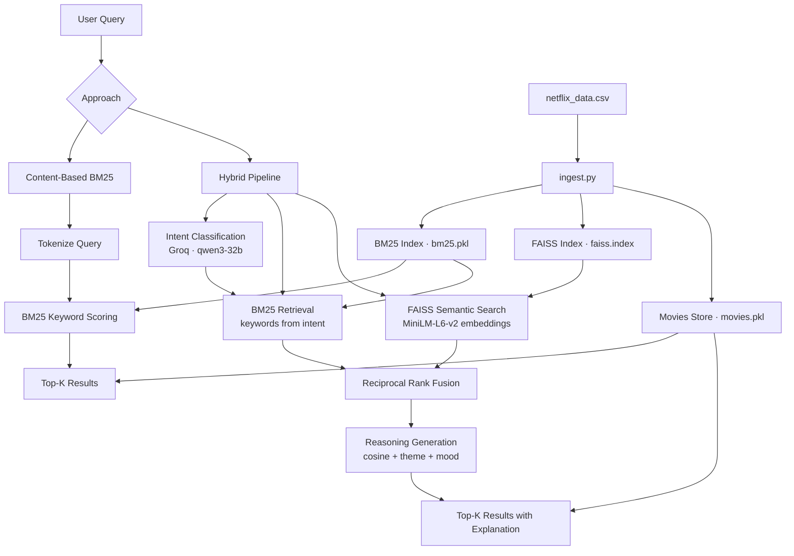

# 🎬 Movie Recommender

A natural language movie recommendation engine with two retrieval approaches — a lightweight BM25 keyword search and a full hybrid pipeline combining semantic vector search with LLM-powered intent understanding.

---

## 🚀 Quick Start

### Using Docker
```bash
docker build -t movie-recommender .
docker run -p 8080:80 movie-recommender
```
Then just open your browser and go to: http://localhost or http://localhost:80
If you want to see the API docs, try: http://localhost/docs


### Local Development
```bash
uvicorn src.main:app --host 0.0.0.0 --port 8080 --reload
```
Or just run:
```bash
run.bat
```


## 🤖 AI Setup

| Component | Provider | Model |
|-----------|----------|-------|
| Intent Classification | Groq | `qwen/qwen3-32b` |
| Semantic Embeddings | Hugging Face | `sentence-transformers/all-MiniLM-L6-v2` |

Before running, set your Groq API key:
```bash
export GROQ_API_KEY=your_api_key_here
```
Get a free key at [console.groq.com](https://console.groq.com).

---

## 🏗️ Architecture




---

## 🔀 Two Approaches

### 1. Content-Based (BM25)
Pure keyword retrieval using [BM25](https://en.wikipedia.org/wiki/Okapi_BM25). Fast and interpretable.

- Tokenizes query (lowercase, punctuation removal)
- Scores all documents by keyword overlap
- Returns ranked top-K results

**Avg latency: ~56ms**

### 2. Hybrid (BM25 + FAISS + LLM Intent)
A full semantic pipeline that understands the *meaning* of your query, not just the words.

- **Step 0** — Groq extracts structured intent: mood, genre, themes, keywords
- **Step 1** — BM25 retrieval using extracted keywords
- **Step 2** — FAISS semantic search using MiniLM embeddings (cosine similarity via `IndexFlatIP`)
- **Step 3** — [Reciprocal Rank Fusion (RRF)](https://plg.uwaterloo.ca/~gvcormac/cormacksigir09-rrf.pdf) fuses both ranked lists without score-scale bias
- **Step 4** — Reasoning generated from cosine similarity + theme/mood match

**Avg latency: ~1363ms** | **24x slower, but higher quality**

---

## 📊 Benchmark Results

Evaluated across 10 diverse natural language queries.

| Metric | Content-Based | Hybrid |
|--------|--------------|--------|
| Avg Latency | 55.8 ms | 1363.2 ms |
| Avg LLM Quality Score (1–5) | 2.36 | **2.80** |
| Avg Genre Diversity | 5.6 | **7.0** |
| Avg Jaccard Similarity (overlap between approaches) | — | 0.17 |
| Avg Shared Titles | — | 1.4 / 5 |

> Quality scores judged by an LLM evaluator on relevance (1–5 scale). Low overlap (0.17 Jaccard) confirms the two approaches surface meaningfully different results.

---

## 🗂️ Project Structure

```
Movie_Recommendation/
├── src/
│   ├── main.py                 # FastAPI app entry point
│   ├── ingest.py               # CSV → BM25 + FAISS index builder
│   ├── content_retriever.py    # BM25-only retrieval
│   ├── hybrid_retriever.py     # BM25 + FAISS + RRF pipeline
│   └── recommender.py          # Intent classification + final output parsing
│   └── test.py                 # Benchmarking
├── static/
│   └── index.html              # Frontend UI
├── data/
│   └── processed/              # Generated indexes (auto-created by ingest.py)
│       ├── bm25.pkl
│       ├── faiss.index
│       ├── movies.pkl
│       └── benchmark_results.json
├── Dockerfile
├── requirements.txt
└── run.bat                       # One-click local dev launcher
└── Claude.md                     # Helper md
└── Benchmarked_results.txt       # Detailed Results
└── .env                          ##################    ADD  {GROQ_API_KEY = gsk_xxxxxxxxxxxxxxxxxxxxxxxxxxxx}
```

---

## 🎥 Demo

> 📸 _Screenshot / video placeholder — add a demo GIF or screenshot here_

---

# Code Review to Track what's done in each file
### Indexing (`ingest.py`)

Run once to build the search indexes from `netflix_data.csv`:
- Fits BM25 on concatenated movie metadata
- Encodes all movies with MiniLM → normalizes → stores in FAISS `IndexFlatIP`
- Saves a lightweight movie dictionary (title, genre, description, etc.) for fast lookup at query time
```
src > ingest.py — Load netflix_data.csv once, build FAISS + BM25 indexes, save artifacts to data/processed/ for use by the retrievers.

Load dataset 
Fit BM25API on concatinated information
Build FAISS index ---- Embedding - > Fit into normalized + flattend indexes


Build movies : 

This function is the "Data Trimmer." Its job is to take a massive, heavy DataFrame (which might have dozens of columns you don't need) and turn it into a lightweight list of Python dictionaries that are easy to access during a search.

Think of it as packing a "go-bag" for your application—you're only taking the essentials so the search engine can run faster.

```

### Content based (`content_retriever.py `): 
  1) Uses Matched tokens to Rank moview=s from historical Dataset using BM25
```
src > content_retriever.py — Pure BM25 keyword-based retrieval.
    
    indexes are retirved like : 
    bm25_path = PROCESSED_DIR / "bm25.pkl"
    movies_path = PROCESSED_DIR / "movies.pkl"

    A function to tokenize query : 
    Lowercasing
    Removing Punctuation text.translate(...)
    Splitting and Filtering


    retrieve: 
    first preprocess query
    get indexes intialized 
    Tokenize queries
    Get scores based on tokens
    rank them top k
    returned combined results

```

### Hybrid BM25 + semantic + intent (`hybrid_retriever.py`): 
  1) Uses Bm25, LLM based intent recognition and cosine similarity with FAISS based on Netflix dataset.

```
src > hybrid_retriever.py — BM25 + FAISS semantic search fused via Reciprocal Rank Fusion.

    
    indexes are retirved like : 
    bm25_path = PROCESSED_DIR / "bm25.pkl"
    movies_path = PROCESSED_DIR / "movies.pkl"
    faiss_path = PROCESSED_DIR / "faiss.index"


    A function to tokenize query : 
    Lowercasing
    Removing Punctuation text.translate(...)
    Splitting and Filtering


Step 0 : - Get Intent using groq API
step 1 : -    Run BM25 with *keywords* and return the top-n document indexes ordered by descending score.
step 2 : -    Faiss : indexing as explained below in appendix
step 3 : -    Reciprocal Rank Fusion (RRF) is a clever "democracy" algorithm for search results. It’s used to combine rankings from different sources (like a keyword search and a vector search) into a single, unified list without needing to worry about the actual scores (like "0.85 cosine similarity" vs "12.5 BM25 score").

    retrieve: 
    first preprocess query
    get indexes intialized
    Get Candidate pool — larger than top_k so fusion has signal to rerank from 
    Tokenize queries
    run pipeline : Step 0 and Step 2 (parallel as they are independent)
    Using Intent execute step 1
    Step 4 to fuse Ranking 

    Reasoning using FAISS(Cosine Check), Theme and Mood check (Intent) => to Draft a reason 
    rank them top k
    returned combined results

```
### intent classifcation (`Reccomend.py`): 
  1) Intent Classification using Groq and Postprocessing.
```
src > Reccomend.py

    Intent_classification : Call qwen/qwen3-32b via Groq to extract structured intent from *query*.
    Args:
        query: Free-form user search string.
    Returns:
        IntentResult with mood, genre, themes, and keywords.
        On API or parse failure, returns a minimal fallback derived from
        the raw query so the hybrid pipeline can still proceed.


    Final Groq Client intialization

    Final Output Parsing

```

### Benchmarking (`test.py`): 
  1) 10 syntheic queries used for judging the diffrence between two appproaches.
  2) LLm as a judge used for comparing quality of reccomednations of both approaches.

```
Runs 10 synthetic queries through both retrievers and writes results to data/processed/benchmark_results.json.
4 metrics measured per query:

Score Transparency — raw BM25 scores (content-based) and cosine + RRF scores (hybrid)
Result Overlap — Jaccard similarity and shared titles between both methods
Diversity — unique genres, content types, and release year spread within each result set
Latency — milliseconds per method

LLM-as-Judge — each result set is also rated 1–5 for relevance by llama-3.1-8b-instant via Groq, running concurrently for both methods per query.

```
# Appendix

# FAISS

1. The Setup (Indexing)Suppose we have three documents with the following 3D vectors:
Doc A: $[0.1, 0.9, 0.0]$ (Points mostly "up" the Y-axis)
Doc B: $[0.8, 0.1, 0.1]$ (Points mostly "right" along the X-axis)
Doc C: $[0.1, 0.1, 0.9]$ (Points mostly "out" toward the Z-axis)In IndexFlatIP, FAISS simply stores these as a matrix. It doesn't do anything fancy yet; it just keeps a clean record of where these "arrows" are pointing.

2. The QueryNow, you provide a query vector:
query = [0.2, 0.8, 0.1].
This vector is very similar to Doc A because they both have high values in the second dimension (the Y-axis).3. The Search ProcessWhen you call index.
search(query, k=1), FAISS performs a Brute Force calculation (because IndexFlat means "no compression/no clusters").Normalization: As we discussed, FAISS scales the query vector so its length is exactly 1.0.

Dot Product Calculation: It multiplies the query against every vector in the index:
Query $\cdot$ 
Doc A: $(0.2 \times 0.1) + (0.8 \times 0.9) + (0.1 \times 0.0) = \mathbf{0.74}$Query $\cdot$ 
Doc B: $(0.2 \times 0.8) + (0.8 \times 0.1) + (0.1 \times 0.1) = 0.25$Query $\cdot$ 
Doc C: $(0.2 \times 0.1) + (0.8 \times 0.1) + (0.1 \times 0.9) = 0.19$4. 
The ResultFAISS looks at the scores $(0.74, 0.25, 0.19)$ and identifies that 0.74 is the highest.
Internal Return: It finds the position of $0.74$ in the list (index 0).Function Return: Your _faiss_rank function returns ([0], [0.74]).


# RRF : 
Reciprocal Rank Fusion (RRF) is a clever "democracy" algorithm for search results. It’s used to combine rankings from different sources (like a keyword search and a vector search) into a single, unified list without needing to worry about the actual scores (like "0.85 cosine similarity" vs "12.5 BM25 score").

Here is the breakdown of why and how this code works:
1. The Core FormulaThe mathematical logic being applied in your loops is:
$$RRFscore(d \in D) = \sum_{r \in R} \frac{1}{k + r(d)}$$$r(d)$:
The rank of document $d$ in a list (1st place, 2nd place, etc.).
$k$: A constant (usually 60). It prevents documents ranked very high (like rank 1) from completely overwhelming the total score.

2. Why use this instead of just averaging scores?In search systems, you often have a "Scale Mismatch" problem:BM25 (Keyword search) might give scores from 0 to 100+.FAISS (Vector search) might give scores from 0.7 to 1.0.You can't just add $100 + 0.7$—the keyword search would always win. RRF ignores the raw scores entirely. It only cares that a document was "1st" in one list and "5th" in another. This makes it a "rank-based" ensemble method rather than a "score-based" one.


# Why There is a Reasoning Aspect in Hybrid : 
In modern AI applications, "Black Box" recommendations (where you get a result but don't know why) are often less trusted by users. This code provides Transparency.

By showing the Semantic Similarity (how well the meaning matched) alongside Themes (hard metadata matches), you are combining "fuzzy" AI logic with "exact" keyword logic in a way the user can understand.

